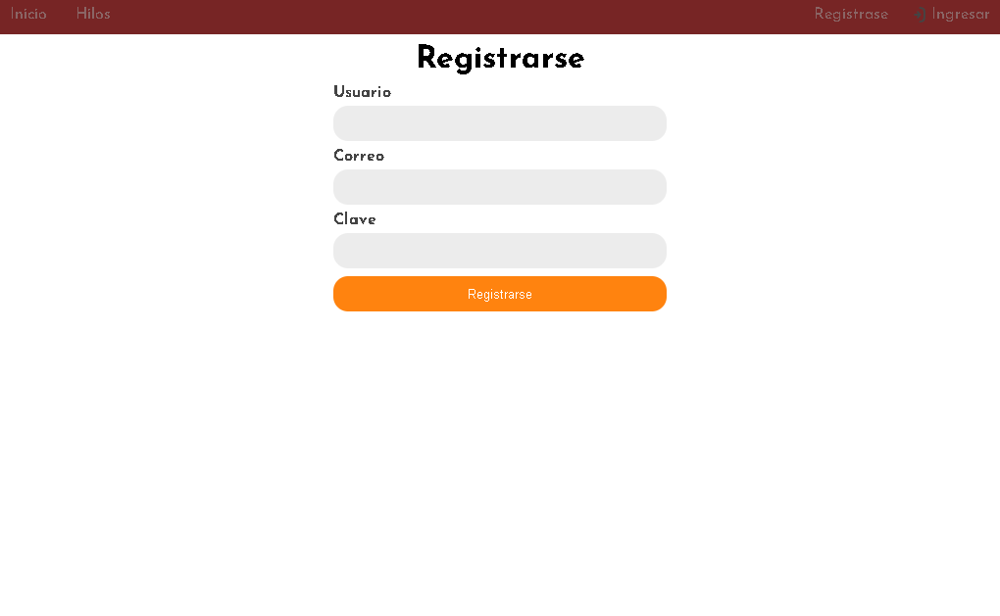
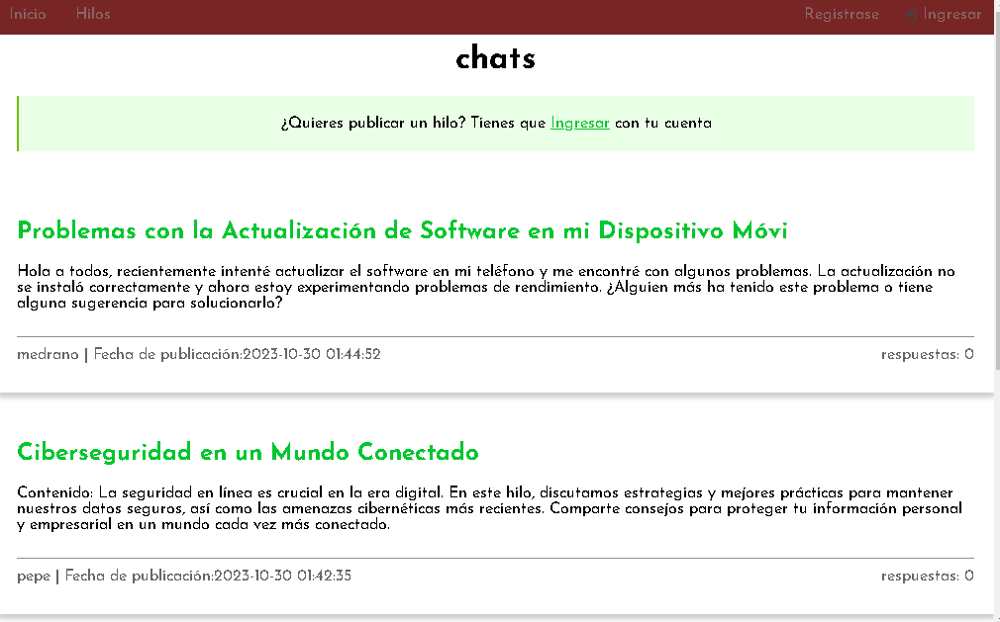

# Project Foro

> This project has the purpose of creating a forum

         

This project is intended to create a forum to demonstrate my skills in PHP mysql.

## Built With

- html
- css
- php
- mysql

## Live Demo

[Live Demo Link](https://livedemo.com)

## Getting Started

**This is an example of how you may give instructions on setting up your project locally.**
**Modify this file to match your project, remove sections that don't apply. For example: delete the testing section if the currect project doesn't require testing.**

To get a local copy up and running follow these simple example steps.

### Prerequisites

### Setup

### Install

### Usage

### Run tests

### Deployment

## Authors

👤 **Jarvin Adrian Briceño Angulo**

- GitHub: [@Jarvinbri](https://github.com/Jarvinbri)

## 🤝 Contributing

Contributions, issues, and feature requests are welcome!

Feel free to check the [issues page](https://github.com/Jarvinbri/foro_adrian/issues).

## Show your support

Give a ⭐️ if you like this project!

## Acknowledgments

- UneWeb 

## 📝 License

This project is [CC0 1.0 Universal](LICENSE) licensed.
